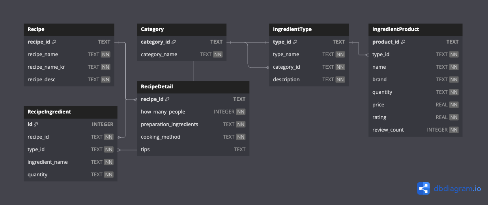

# Capstone Project

# Data Generation

```bash
cd ./capstone-2025q1
source $(poetry env info --path)/bin/activate
python ./data-generation.py
python ./data-to-sql.py
```

- Generate the data and save it to the [`./data`](./data) folder. [🔗](./data-generation.py)

    - [`./data/recipes_{YYYYMMDD}.json`](./data)

    - [`./data/ingredients_{YYYYMMDD}.json`](./data)

- Convert the data to the SQLite database. [🔗](./data-to-sql.py)

    - [`./data/data_{YYYYMMDD}.db`](./data/data_{YYYYMMDD}.db)

# Database Table Details

[](https://dbdiagram.io/d/680236c61ca52373f57d7030)

- 데이터베이스는 정보를 체계적으로 정리하기 위해 여러 개의 **표(Table)** 로 데이터를 나누어 저장합니다. 각 표는 특정 주제에 대한 정보만 담고 있고, 서로 필요한 정보를 연결(관계)해서 사용합니다. 이 데이터베이스에는 총 6개의 테이블이 있습니다.<br>The database is designed to organize information systematically by dividing data into multiple **tables**. Each table contains information about a specific topic and uses connections (relationships) to link related information. This database contains a total of 6 tables.

## 1. `Recipe` Table

### Purpose

- 이 테이블은 제공하는 여러 가지 **한식 레시피** 자체에 대한 정보를 저장하는 곳입니다.<br>This table stores information about various **Korean recipes** provided.

### Columns (Columns of the table)

- `recipe_id` (TEXT, **PK**): 각 레시피를 구별하는 고유한 **텍스트** 이름표입니다 (예: `"kimchijjigae"`, `"bulgogi"`). 이 값은 절대 중복되지 않으며, 레시피를 식별하는 **기본 키(Primary Key, PK)** 입니다.<br>This is a unique **text** identifier (e.g., `"kimchijjigae"`, `"bulgogi"`) to distinguish each recipe. This value is unique and serves as the **primary key (PK)**.

- `recipe_name` (TEXT): 레시피의 영어/로마자 이름입니다 (현재 스크립트에서는 `recipe_id`와 동일).<br>This is the English/Romanized name of the recipe (currently the same as `recipe_id`).

- `recipe_name_kr` (TEXT): 레시피의 한글 이름입니다 (예: `"김치찌개"`).<br>This is the Korean name of the recipe (e.g., `"Kimchijjigae"`).

- `recipe_desc` (TEXT): 해당 레시피가 어떤 음식인지 설명하는 글입니다 (한글/영어 포함).<br>This is a description of what kind of food the recipe is (includes Korean and English).

### Example data

- `"bulgogi"`, `"Bulgogi"`, `"불고기"`, `"간장, 꿀, ... 구워 먹는다."`

### Connection

- 이 테이블의 `recipe_id`는 `RecipeIngredient` 테이블에서 어떤 레시피에 어떤 재료가 필요한지 연결할 때 사용됩니다.<br>This `recipe_id` is used in the `RecipeIngredient` table to link recipes to their required ingredients.

## 2. `RecipeDetail` Table

### Purpose

- 각 레시피의 **상세 조리 정보** 를 저장하는 테이블입니다. 요리할 때 필요한 상세 내용을 담고 있습니다.<br>This table stores **detailed cooking information** for each recipe. It contains the specifics needed when cooking.

### Columns (Columns of the table)

- `recipe_id` (TEXT, **PK**, **FK**): 어떤 레시피에 대한 정보인지를 나타냅니다. `Recipe` 테이블의 `recipe_id`를 참조하는 **외래 키(FK)** 이자 **기본 키(PK)** 입니다.<br>Indicates which recipe this information is about. It is a **foreign key (FK)** referencing the `recipe_id` in the `Recipe` table and also serves as the **primary key (PK)**.

- `how_many_people` (INTEGER): 해당 레시피가 몇 인분인지 나타냅니다 (예: `4`).<br>Indicates how many servings the recipe makes (e.g., `4`).

- `preparation_ingredients` (TEXT): 요리 전 재료 준비 방법에 대한 상세 설명입니다.<br>Detailed explanation of how to prepare the ingredients before cooking.

- `cooking_method` (TEXT): 실제 조리 과정에 대한 단계별 설명입니다.<br>Step-by-step explanation of the actual cooking process.

- `tips` (TEXT): 요리를 더 맛있게 만들기 위한 조언이나 대체 재료 제안 등을 포함합니다.<br>Includes advice for making the dish tastier or suggestions for alternative ingredients.

### Example data

- `"bulgogi"`, `4`, `"1. Cut the Beef Sirloin..."`, `"Pan fry the beef..."`, `"In general, bulgogi is made from..."`

### Connection

- `recipe_id` (FK)를 통해 `Recipe` 테이블과 연결됩니다.<br>Connects to the `Recipe` table via `recipe_id` (FK).

## 3. `RecipeIngredient` Table

### Purpose

- 레시피와 필요한 재료를 연결하고, 각 재료에 대한 **정확한 양과 사용법** 을 저장하는 테이블입니다. 이 테이블은 레시피와 식재료 타입 간의 관계를 나타내며, 레시피별로 필요한 재료의 정확한 양을 명시합니다.<br>This table links recipes with their required ingredients and stores the **exact quantity and usage** for each ingredient. It represents the relationship between recipes and ingredient types, specifying the exact amount of each ingredient needed for a recipe.

### Columns (Columns of the table)

- `id` (INTEGER, **PK**): 각 행을 구별하는 고유한 **자동 증가** ID입니다. **기본 키(PK)** 입니다.<br>This is a unique **auto-incrementing** ID that distinguishes each row. It serves as the **primary key (PK)**.

- `recipe_id` (TEXT, **FK**): 어떤 레시피에 대한 정보인지를 나타냅니다. `Recipe` 테이블의 `recipe_id`를 참조하는 **외래 키(FK)** 입니다.<br>Indicates which recipe this entry is about. It is a **foreign key (FK)** referencing `Recipe.recipe_id`.

- `type_id` (TEXT, **FK**): 어떤 재료 종류에 대한 정보인지를 나타냅니다. `IngredientType` 테이블의 `type_id` 값을 참조하는 **외래 키(FK)** 입니다.<br>Indicates which ingredient type this entry is about. It is a **foreign key (FK)** referencing `IngredientType.type_id`.

- `ingredient_name` (TEXT): 레시피에 사용된 재료의 정확한 이름입니다 (예: `"Beef Sirloin"`, `"Onion"`).<br>The exact name of the ingredient used in the recipe (e.g., `"Beef Sirloin"`, `"Onion"`).

- `quantity` (TEXT): 해당 재료가 필요한 양입니다 (예: `"500g"`, `"2Tbsp"`).<br>The amount of the ingredient needed (e.g., `"500g"`, `"2Tbsp"`).

### Example data

- `1`, `"bulgogi"`, `"beef_sirloin"`, `"Beef Sirloin"`, `"500g"`

- `2`, `"bulgogi"`, `"onion"`, `"Onion"`, `"200g"`

### Connection

- `recipe_id` (FK)를 통해 `Recipe` 테이블과 연결됩니다.<br>Connects to the `Recipe` table via `recipe_id` (FK).

- `type_id` (FK)를 통해 `IngredientType` 테이블과 연결됩니다.<br>Connects to the `IngredientType` table via `type_id` (FK).

- 이 테이블은 "불고기 레시피에 필요한 재료 목록과 양"이나 "마늘을 사용하는 레시피 목록" 같은 정보를 쉽게 찾을 수 있게 해줍니다.<br>This table makes it easy to find information such as "the list of ingredients and quantities needed for the bulgogi recipe" or "the list of recipes using garlic".

## 4. `Category` Table

### Purpose

- 식료품 가게의 상품들을 큰 **분류(카테고리)** 로 나누기 위한 테이블입니다. 예를 들어 "채소류", "육류", "조미료류" 같은 큰 그룹 정보를 관리합니다.<br>This table is used to categorize products in a grocery store into large **categories**. For example, it manages information about large groups such as "vegetables", "meats", and "seasonings".

### Columns (Columns of the table)

- `category_id` (TEXT, **PK**): 각 카테고리를 구별하는 고유한 **텍스트** 이름표입니다 (예: `"vegetables"`, `"meats"`). **기본 키(PK)** 입니다.<br>This is a unique **text** identifier (e.g., `"vegetables"`, `"meats"`) to distinguish each category. This value is unique and serves as the **primary key (PK)**.

- `category_name` (TEXT): 화면에 보여줄 카테고리의 실제 이름입니다 (예: `"Vegetables"`).<br>This is the actual name of the category to be displayed on the screen (e.g., `"Vegetables"`).

### Example data

- `"vegetables"`, `"Vegetables"`

### Connection

- 이 테이블의 `category_id`는 `IngredientType` 테이블에서 각 재료 종류가 어떤 카테고리에 속하는지 알려줄 때 사용됩니다.<br>This `category_id` is used in the `IngredientType` table to indicate which category each ingredient type belongs to.

## 5. `IngredientType` Table

### Purpose

- 개별 상품이 아니라, **식재료의 종류** 자체(예: "마늘", "돼지 삼겹살")에 대한 정보를 저장합니다.<br>This table stores information about the **type of ingredients** (e.g., "garlic", "pork belly") rather than individual products.

### Columns (Columns of the table)

- `type_id` (TEXT, **PK**): 각 식재료 종류를 구별하는 고유한 **텍스트** 이름표입니다 (예: `"garlic"`, `"pork_belly"`). 이름에서 자동으로 생성되며, **기본 키(PK)** 입니다.<br>This is a unique **text** identifier (e.g., `"garlic"`, `"pork_belly"`), automatically generated from the name, to distinguish each ingredient type. This value is unique and serves as the **primary key (PK)**.

- `type_name` (TEXT): 화면에 보여줄 식재료 종류의 이름입니다 (예: `"Garlic"`, `"Pork Belly"`).<br>This is the name of the ingredient type to be displayed on the screen (e.g., `"Garlic"`, `"Pork Belly"`).

- `category_id` (TEXT, **FK**): 이 식재료가 어떤 카테고리에 속하는지를 알려주는 정보입니다. `Category` 테이블의 `category_id` 값을 참조하는 **외래 키(Foreign Key, FK)** 입니다. 예를 들어, "garlic"의 `category_id`가 "vegetables" 라면, 마늘이 채소류 카테고리에 속한다는 뜻입니다.<br>This indicates which category the ingredient type belongs to. It is a **foreign key (FK)** that references the `category_id` in the `Category` table. For example, if the `category_id` for "garlic" is "vegetables", it means garlic belongs to the vegetables category.

- `description` (TEXT): 해당 식재료 종류에 대한 설명입니다 (한글/영어 포함).<br>This is a description of the type of ingredient (includes Korean and English).

### Example data

- `"garlic"`, `"Garlic"`, `"vegetables"`, `"한국 요리의 필수품! ... 풍미를 더해줘요."`

### Connection

- `category_id` (FK)를 통해 `Category` 테이블과 연결됩니다 (어떤 카테고리에 속하는지).<br>Connects to the `Category` table via `category_id` (FK) (indicates which category it belongs to).

- `type_id` (PK)는 다른 테이블에서 참조됩니다:<br>The `type_id` (PK) is referenced by other tables:
    
    - `IngredientProduct` 테이블: 각 상품이 어떤 종류인지 알려줍니다.<br>`IngredientProduct` table: Indicates the type of each product.
    
    - `RecipeIngredient` 테이블: 레시피에 필요한 재료 종류를 지정합니다.<br>`RecipeIngredient` table: Specifies the ingredient types needed for recipes.

## 6. `IngredientProduct` Table

### Purpose

- 실제로 **판매하는 개별 식재료 상품** 들의 상세 정보를 저장합니다. (예: "A사 깐마늘 100g", "B사 유기농 배 1개")<br>This table stores detailed information about **individual ingredient products** available for sale (e.g., "Brand A Peeled Garlic 100g", "Brand B Organic Pear 1ea").

### Columns (Columns of the table)

- `product_id` (TEXT, **PK**): 각 판매 상품을 구별하는 고유한 **텍스트** 이름표입니다 (예: `"vegetable-garlic-0"`). **기본 키(PK)** 입니다.<br>This is a unique **text** identifier (e.g., `"vegetable-garlic-0"`) to distinguish each product item. This value is unique and serves as the **primary key (PK)**.

- `type_id` (TEXT, **FK**): 이 상품이 어떤 **종류** 의 식재료인지를 알려줍니다. `IngredientType` 테이블의 `type_id` 값을 참조하는 **외래 키(FK)** 입니다 (예: `"garlic"`).<br>Indicates what **type** of ingredient this product is. It is a **foreign key (FK)** referencing the `type_id` in the `IngredientType` table (e.g., `"garlic"`).

- `name` (TEXT): 상품의 실제 이름입니다 (예: `"Fresh Garlic"`).<br>This is the actual name of the product (e.g., `"Fresh Garlic"`).

- `brand` (TEXT): 상품의 브랜드 이름입니다 (예: `"Organic Choice"`).<br>This is the brand name of the product (e.g., `"Organic Choice"`).

- `quantity` (TEXT): 상품의 양이나 개수입니다 (예: `"100g"`, `"1ea"`).<br>This is the quantity or count of the product (e.g., `"100g"`, `"1ea"`).

- `price` (REAL): 상품의 가격입니다 (숫자).<br>This is the price of the product (number).

- `rating` (REAL): 고객 평점입니다 (숫자).<br>This is the customer rating (number).

- `review_count` (INTEGER): 상품 리뷰 개수입니다 (숫자).<br>This is the number of product reviews (number).

### Example data

- `"vegetable-garlic-0"`, `"garlic"`, `"Fresh Garlic"`, `"Organic Choice"`, `"100g"`, `2.5`, `2.3`, `95`

### Connection

- `type_id` (FK)를 통해 `IngredientType` 테이블과 연결되어, 이 상품이 "마늘" 종류라는 것을 알 수 있습니다.<br>Connects to the `IngredientType` table via `type_id` (FK), allowing us to know, for example, that this product is of the "garlic" type.

# Data Source

- 행정안전부 - 공공데이터포털 (Ministry of the Interior and Safety - Open Government Data portal) : https://www.data.go.kr/en/data/15129784/fileData.do

- 한식진흥원 (Korean Food Promotion Institute) : https://www.hansik.or.kr/main/main.do?language=en_US